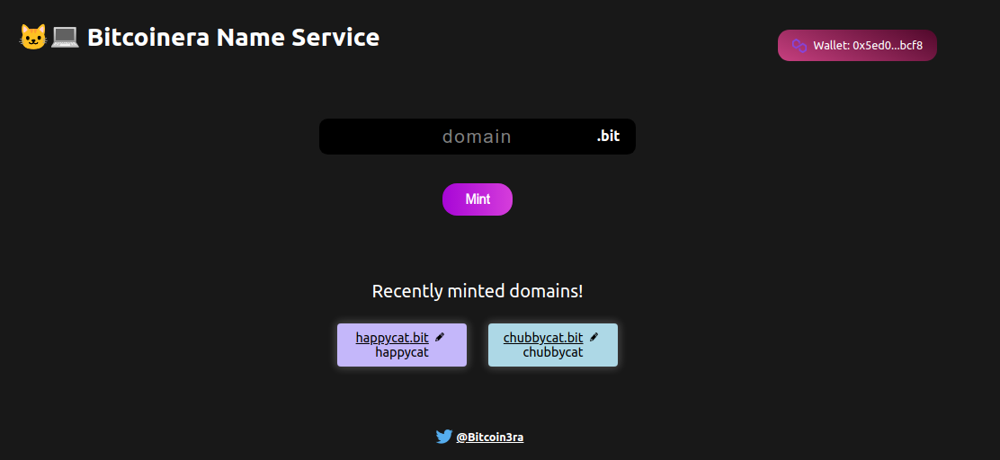

# buildspace DNS starter project

## My DApp, the Bitcoinera Name Service DApp

    

 

### Description

This is a fork of [the original repo](https://github.com/AlmostEfficient/domain-starter) by [the \_buildspace collective](https://buildspace.so/p).

It is a very simple React DApp made to interact with the `NFTDomains.sol` contract living in the other repo, [polygon-ens](https://github.com/Bitcoinera/polygon-ens), which is a HardHat project. The core idea of the project is to have a ENS-like (Ethereum Name Service) service built on Polygon, where users can use this DApp to mint their own domains (which are created together with some NFTs), as well as see a list of their domains and visit the OpenSea listing.

There is also an edit function but this hasn't been yet fully implemented. Also, the NFTs are very minimal and they all look the same. Some square with a gradient and a rainbow. Nothing fancy. Just a minimalistic PoC.

All credits for the idea and also the implementation to [the \_buildspace community](https://buildspace.so/p), which has done a fantastic work making the tutorial and having the idea for this super cool project.

### Setup

1. Run `npm install` at the root of your directory
2. Run `npm run start` to start the project
